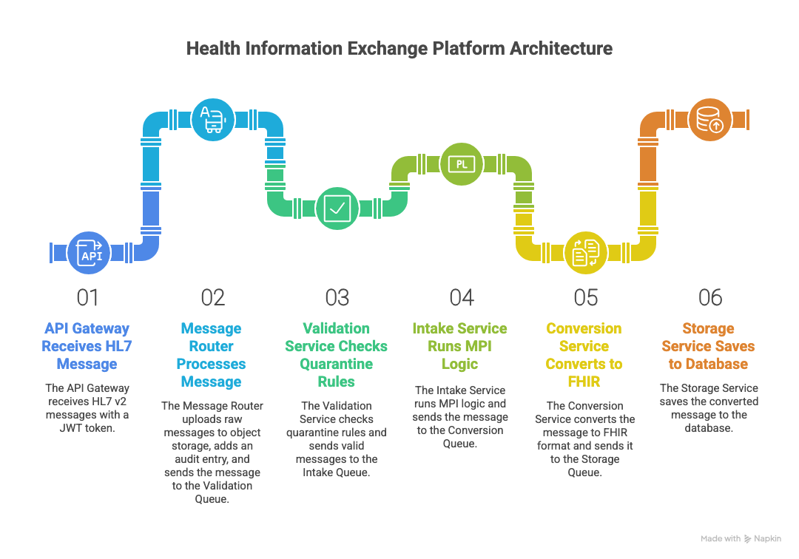

# HIE Platform - Health Information Exchange

A comprehensive health information exchange platform built with microservices architecture for processing, validating, and managing HL7 messages.

## Architecture Overview


The HIE Platform is designed as a distributed system with the following core components:

- **API Gateway** - Central entry point for all external requests
- **OAuth Service** - Spring based oAuth Service, which support client registration and client_credentials flow.
- **Validation Service** - HL7 message validation and compliance checking
- **Intake Service** - Message ingestion and initial processing
- **Conversion Service** - Format transformation and standardization
- **Storage Service** - Persistent storage and retrieval management

## Key Features

- **Microservices Architecture** - Scalable and maintainable service-oriented design
- **HL7 Message Processing** - Full support for HL7 message validation and transformation
- **Real-time Monitoring** - Comprehensive observability with Prometheus, Grafana, and Jaeger
- **Message Queuing** - Reliable message processing with RabbitMQ
- **Object Storage** - Efficient file storage using MinIO
- **Audit Trail** - Complete message tracking and audit capabilities
- **Quarantine System** - Automatic isolation of problematic messages

## Technology Stack

### Core Technologies
- **Java 17** - Primary development language
- **Spring Boot** - Microservices framework
- **Maven** - Build and dependency management
- **Docker** - Containerization

### Infrastructure
- **PostgreSQL** - Primary database
- **RabbitMQ** - Message queue
- **Redis** - Caching layer
- **MinIO** - Object storage
- **Prometheus** - Metrics collection
- **Grafana** - Monitoring dashboards
- **Jaeger** - Distributed tracing

### Recommended Infrastructure:
```
 Production sizing recommendations
Services:
- API Gateway: 2 instances (2 CPU, 4GB RAM each)
- Validation Service: 3 instances (1 CPU, 2GB RAM each)
- InTake Service: 5 instances (2 CPU, 4GB RAM each)
- Conversion Service: 4 instances (2 CPU, 4GB RAM each)
- Storage Service: 3 instances (1 CPU, 2GB RAM each)

Message Queue:
- RabbitMQ Cluster: 3 nodes with high availability
- Queue depth monitoring with auto-scaling triggers

Database:
- PostgreSQL with read replicas for audit queries
- Connection pooling (HikariCP) with 20 connections per service instance

Storage:
- S3/MinIO with lifecycle policies for archival
- Redis for caching frequently accessed data

```
## Prerequisites

- macOS (this setup is optimized for macOS)
- Admin access to install software
- At least 8GB RAM recommended
- 10GB free disk space


## 🚀 Getting Started

## Quick Start

### Clone the Repository
```bash
git clone <repository-url>
cd hie-platform
```

### 1. Run Setup Script

```bash
# Follow the complete setup guide
cat setup.md
```

### 2. Start Development Environment

```bash
# Start all infrastructure services
./scripts/start-dev.sh
```

### 3. Verify Installation

```bash
# Check all services are running
cd docker-compose
docker-compose ps
```

## 📁 Project Structure

```
hie-platform/
├── api-gateway/              # API Gateway service
├── validation-service/       # Message validation service
├── intake-service/           # Message intake service
├── conversion-service/       # Format conversion service
├── storage-service/          # Storage management service
├── docker-compose/           # Infrastructure configuration
│   ├── docker-compose.yml
│   ├── prometheus.yml
│   └── init-scripts/
├── kubernetes/               # K8s deployment configs
├── scripts/                  # Development scripts
│   ├── start-dev.sh
│   └── stop-dev.sh
├── docs/                     # Documentation
└── infrastructure/           # Infrastructure configs
```

## 🔗 Service Endpoints

| Service              | URL                        | Credentials              |
|----------------------|----------------------------|---------------------------|
| RabbitMQ Management  | http://localhost:15672     | admin / admin123          |
| MinIO Console        | http://localhost:9001      | minioadmin / minioadmin123 |
| Grafana Dashboard    | http://localhost:3000      | admin / admin123          |
| Prometheus           | http://localhost:9090      | -                         |
| Jaeger Tracing       | http://localhost:16686     | -                         |
| Zipkin Tracing       | http://localhost:9411      | -                         |

## 🗃️ Database Schema

- `message_audit` – Comprehensive audit trail for all messages  
- `message_state` – Current state tracking for messages  
- `quarantine_messages` – Isolated problematic messages  

## 📊 Monitoring & Observability

### Metrics

- Prometheus collects metrics from all services  
- Grafana provides visual dashboards  
- Custom metrics for message processing, error rates, and performance  

### Tracing

- Jaeger for distributed tracing  
- Zipkin as alternative tracing solution  
- Request flow tracking across microservices  

### Logging

- Centralized logging configuration  
- Structured logging with correlation IDs  
- Log aggregation and analysis  

## 🛠 Development

### Running Services Locally

```bash
# Start infrastructure
./scripts/start-dev.sh

# Build and run individual services
cd api-gateway
mvn spring-boot:run

cd validation-service
mvn spring-boot:run
```

### Testing

```bash
# Run unit tests
mvn test

# Run integration tests
mvn verify

# Check infrastructure health
curl -u admin:admin123 http://localhost:15672/api/overview
```

### Creating New Services

```bash
mvn archetype:generate \
  -DgroupId=com.hie.platform \
  -DartifactId=new-service \
  -DarchetypeArtifactId=maven-archetype-quickstart \
  -DinteractiveMode=false
```

## ⚙️ Configuration

### Environment Variables

- `POSTGRES_DB` – Database name  
- `POSTGRES_USER` – Database username  
- `POSTGRES_PASSWORD` – Database password  
- `RABBITMQ_DEFAULT_USER` – RabbitMQ username  
- `RABBITMQ_DEFAULT_PASS` – RabbitMQ password  
- `MINIO_ROOT_USER` – MinIO access key  
- `MINIO_ROOT_PASSWORD` – MinIO secret key  

### Service Configuration

Each service uses Spring Boot configuration with profiles:

- `application.yml` – Base configuration  
- `application-dev.yml` – Development settings  
- `application-prod.yml` – Production settings  

## 📬 Message Processing Flow

1. Intake – Messages received via API Gateway  
2. Validation – HL7 compliance and business rule validation  
3. Conversion – Format transformation if needed  
4. Storage – Persistent storage with metadata  
5. Audit – Complete audit trail creation  
6. Notification – Status updates and alerts  

## ❗ Error Handling

- Quarantine System – Automatic isolation of invalid messages  
- Retry Logic – Configurable retry attempts for transient failures  
- Dead Letter Queues – Failed message collection for analysis  
- Alert System – Real-time notifications for critical issues  

## 🔐 Security

- Authentication – JWT-based authentication  
- Authorization – Role-based access control  
- Encryption – Data encryption at rest and in transit  
- Audit Logging – Complete security audit trail  

## 📈 Scaling

- Horizontal Scaling – Scale individual services independently  
- Load Balancing – Distribute traffic across service instances  
- Caching – Redis caching for performance optimization  
- Database Optimization – Indexed queries and connection pooling  

## 🧰 Troubleshooting

### Common Issues

**Services not starting**

```bash
# Check Docker daemon
docker ps

# Check service logs
docker-compose logs -f [service-name]
```

**Database connection issues**

```bash
# Test database connectivity
docker exec -it hie-postgres psql -U hie_user -d hie_platform
```

**Memory issues**

```bash
# Check Docker memory usage
docker stats
```

### Getting Help

- Check the logs: `docker-compose logs -f`  
- Verify service health: `docker-compose ps`  
- Review configuration files  
- Check network connectivity between services  

## 📚 Documentation

- **Setup Guide** – Complete development environment setup  
- **API Documentation** – REST API specifications  
- **Architecture Guide** – System design and patterns  
- **Deployment Guide** – Production deployment instructions  

## 🤝 Contributing

1. Fork the repository  
2. Create a feature branch  
3. Make your changes  
4. Add tests for new functionality  
5. Submit a pull request  

## 📄 License

This project is licensed under the MIT License – see the LICENSE file for details.

## 💬 Support

- Create an issue in the repository  
- Check the troubleshooting section  
- Review the documentation  

> **Note:** This platform is designed for healthcare data processing. Ensure compliance with HIPAA and other relevant regulations when handling patient data.
